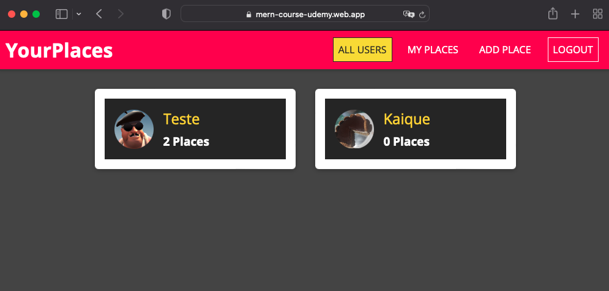

# mern-course-frontend
A frontend project created with React to a simple website called YourPlaces

## How to run the project
Clone the repository

```
git clone https://github.com/otavioramos/mern-course-frontend.git
```

Install the dependencies in your machine
```
npm install
```

Execute the script to start the react development server
```
npm start
```

## Running on production (no longer available)



## Links
[M.E.R.N. Udemy Course](https://www.udemy.com/course/react-nodejs-express-mongodb-the-mern-fullstack-guide/)
